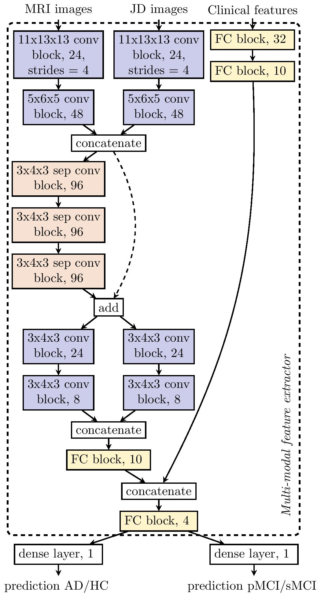
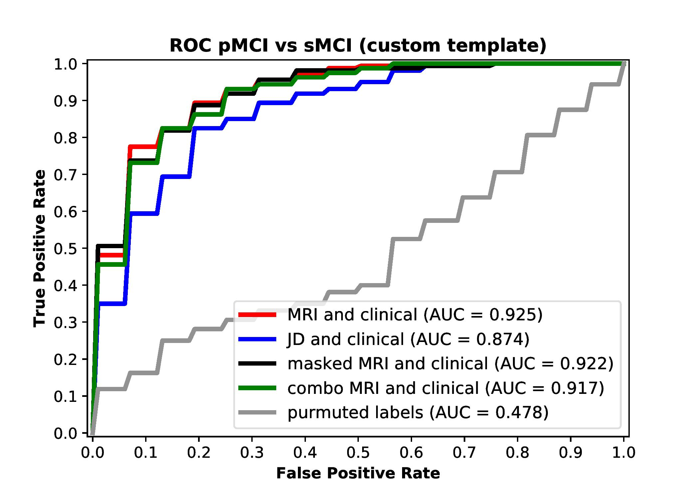

# MCI
A parameter-efficient deep learning approach to predict conversion from mild cognitive impairment to Alzheimer's disease: Spasov et al. [https://www.biorxiv.org/content/early/2018/11/15/383687](https://www.biorxiv.org/content/early/2018/11/15/383687) 

## Overview
We provide our experimentation code for predicting Mild Cognitive Impairment to Alzheimer's Disease conversion. 
+ `mci_train.py` runs our evaluation experiments
+ `utils.py` contains:
    + Out data loading and preprocessing procedures for the structural MRI, Jacobian Determinant images and clinical variables (`preprocess.py`)
    + The data iterator (`augmentation.py`)
    + A custom implementation of 3D separable convolutions (`sepconv3D.py`)
    + The network model architecture (`models.py`)

## Dependencies
The code has been tested under Python 2.7.13, with the following packages installed (along with their dependencies):

+ `numpy==1.14.5`
+ `scipy==1.0.0`
+ `sklearn==0.19.1`
+ `nibabel==2.1.0`
+ `tensorflow-gpu==1.10.1`
In addition, CUDA 9.0 and cuDNN 7 have been used.

## Network Architecture

## ROC curve

ROC curve for classifying using our custom MRI template (and demographic, genetic and cognitive measure)

## License
MIT
